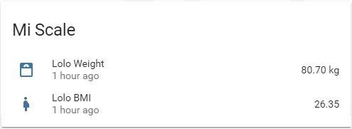
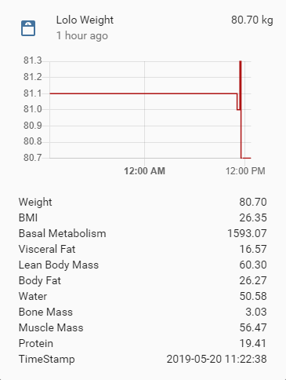

# Xiaomi Mi Scale

Hass.io addon that integrates the Xiaomi Body Composition Scale 1 and 2 into Home Assistant based on the original code from @lolouk44.


## Setup & Configuration

1. Retrieve the scale's MAC Address based on the Xiaomi Mi Fit app.

2. Install the addon (takes a while as the container is built locally)
3. Configure addon

Example user:
```json
 {
      "sex": "male",
      "birthdate": "1990-01-24",
      "height": 180,
      "name": "John",
      "weight_greater_than": 80,
      "weight_lower_than": 90
    }
```
4. Start the addon

## Home-Assistant Setup:
Under the `sensor` block, enter as many blocks as users configured in your environment variables:

```yaml
  - platform: mqtt
    name: "Example Name Weight"
    state_topic: "miScale/USER_NAME/weight"
    value_template: "{{ value_json['Weight'] }}"
    unit_of_measurement: "kg"
    json_attributes_topic: "miScale/USER_NAME/weight"
    icon: mdi:scale-bathroom

  - platform: mqtt
    name: "Example Name BMI"
    state_topic: "miScale/USER_NAME/weight"
    value_template: "{{ value_json['BMI'] }}"
    icon: mdi:human-pregnant

```




